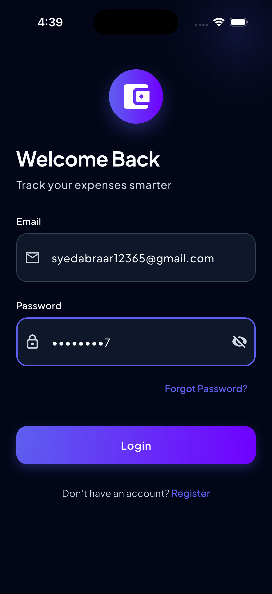
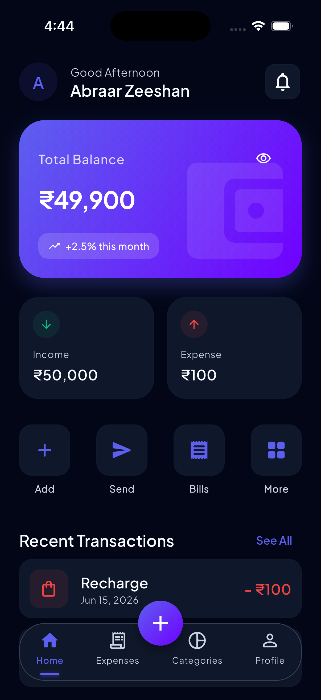
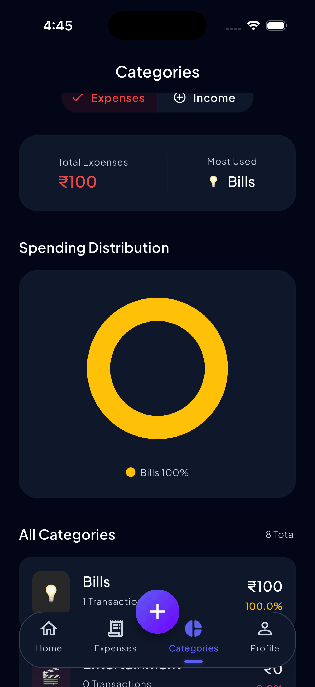
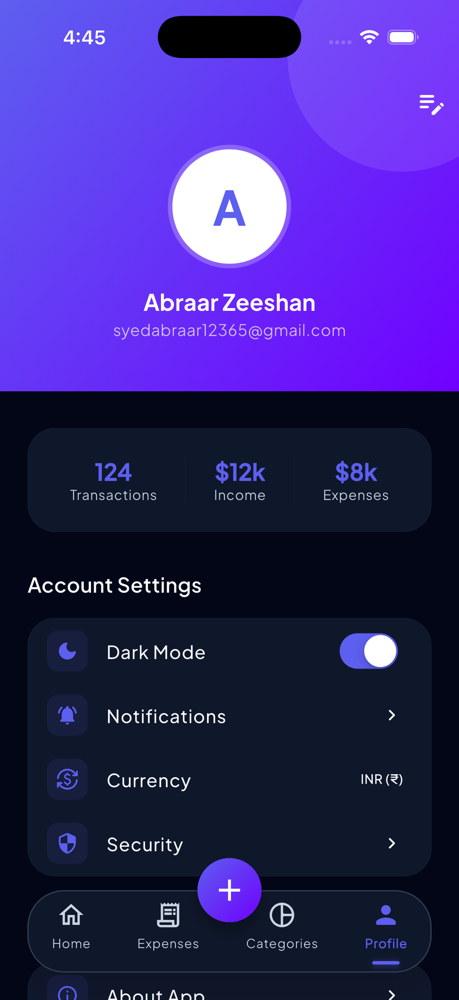

# Expense Tracker Flutter


A production-ready Flutter application for personal finance management built using Clean Architecture, Riverpod 3.0, Isar Database, Freezed, and Dio.

The application provides secure JWT authentication, expense tracking, category management, dashboard analytics, offline data persistence, and seamless integration with a custom Node.js backend deployed on AWS EC2.

---

# Features

- JWT Authentication
- Login & Registration
- Forgot Password
- Reset Password
- Expense CRUD Operations
- Category Management
- Dashboard Analytics
- Offline First Architecture
- Local Database using Isar
- Riverpod 3.0 State Management
- Riverpod Annotation Code Generation
- Freezed Immutable Models
- JSON Serializable Parsing
- Dio Network Layer
- Responsive UI
- Dark & Light Theme Support
- Clean Architecture
- Secure REST API Integration

---

# Tech Stack

| Layer | Technology |
|---------|---------|
| Framework | Flutter |
| Language | Dart |
| State Management | Riverpod 3.0 |
| Code Generation | Riverpod Annotation |
| Local Database | Isar |
| Networking | Dio |
| Model Generation | Freezed |
| Serialization | JSON Serializable |
| Backend | Node.js |
| Database | MongoDB Atlas |
| Cloud Hosting | AWS EC2 |
| Architecture | Clean Architecture |

---

# Architecture

```text
Presentation Layer
       │
       ▼
Riverpod Providers
       │
       ▼
Repository Layer
       │
       ▼
Data Sources
       │
 ┌─────┴─────┐
 ▼           ▼
Remote      Local
(Dio)      (Isar)
 │
 ▼
Node.js API
 │
 ▼
MongoDB Atlas
```

---

# Project Structure

```text
lib/
│
├── core/
│
├── services/
│
├── features/
│   │
│   ├── auth/
│   │   ├── data/
│   │   ├── domain/
│   │   └── presentation/
│   │
│   ├── categories/
│   │   ├── data/
│   │   ├── domain/
│   │   └── presentation/
│   │
│   ├── dashboard/
│   │   ├── data/
│   │   ├── domain/
│   │   └── presentation/
│   │
│   ├── expenses/
│   │   ├── data/
│   │   ├── domain/
│   │   └── presentation/
│   │
│   └── profile/
│
└── main.dart
```

---

# Screenshots

## Login Screen



---

## Register Screen


---

## Dashboard



---

## Categories



---

## Add Expense


---

## Profile



---

# Demo


---

# Backend Repository

Expense Tracker Backend API:

https://github.com/syed-abraar-zeeshan/expense-tracker-backend

---

# Installation

Clone the repository:

```bash
git clone https://github.com/syed-abraar-zeeshan/expense-tracker-flutter.git

cd expense-tracker-flutter
```

Install dependencies:

```bash
flutter pub get
```

Generate files:

```bash
dart run build_runner build --delete-conflicting-outputs
```

Run application:

```bash
flutter run
```

---

# Environment Configuration

Update the API base URL:

```dart
const String baseUrl = "http://YOUR_SERVER_IP/api";
```

Example:

```dart
const String baseUrl = "http://52.66.109.138/api";
```

---

# Backend Features

The Flutter application is connected to a production-ready backend built with:

- Node.js
- Express.js
- MongoDB Atlas
- JWT Authentication
- AWS EC2
- PM2
- Nginx

Backend Repository:

https://github.com/syed-abraar-zeeshan/expense-tracker-backend

---

# Future Improvements

- Expense Reports
- Budget Planning
- Push Notifications
- Multi-Currency Support
- PDF Export
- Data Synchronization
- Biometric Authentication

---

# Author

## Syed Abraar Zeeshan

Flutter Developer | Flutter Full Stack Developer

### Skills

- Flutter
- Dart
- Riverpod
- Freezed
- Isar
- Dio
- Firebase
- Node.js
- MongoDB
- AWS EC2

GitHub:

https://github.com/syed-abraar-zeeshan

Backend Repository:

https://github.com/syed-abraar-zeeshan/expense-tracker-backend

Flutter Repository:

https://github.com/syed-abraar-zeeshan/expense-tracker-flutter
